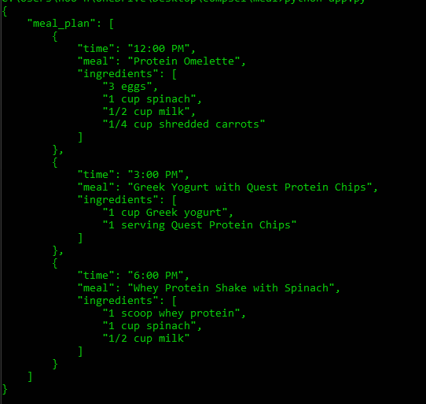

# nutriplan
NutriPlan - Your Intelligent Diet Planner

## Features

- QR code scanning to add food items to the inventory
- Food item search functionality
- Intelligent meal planning considering diet, allergies, and available food items
## Usage

To use the application:

1. Scan a QR code or search for a food item to add it to your inventory.
2. Provide your diet, allergies, and client stats.
3. Receive a custom meal plan in JSON format.
4. ???

## Contributing

please contribute

## License

do whatever you want
